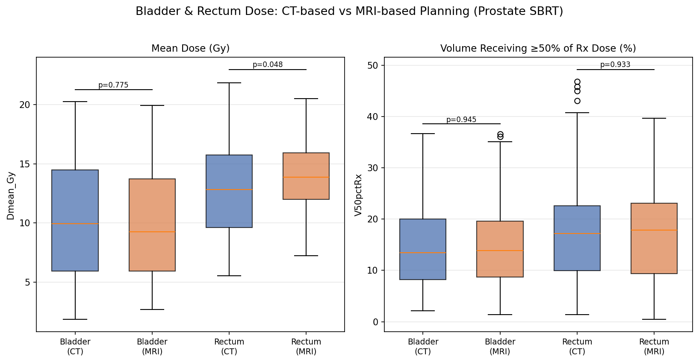

# prostate-sbrt-oar-dose-analysis
# Prostate SBRT OAR Dose Analysis

Retrospective analysis of dose-volume histogram (DVH) data from prostate stereotactic body radiotherapy (SBRT), comparing dose delivered to organs at risk (OARs) between CT-based and MRI-based treatment planning, with an exploratory analysis of whether OAR dose predicts 1-year late toxicity.

Undergraduate research project, UCLA, 2026. Faculty advisor: Dr. Sharon Qi.

## Key result

Rectal mean dose differed significantly between CT-planned and MRI-planned cohorts (Mann-Whitney U, **p = 0.048**), while bladder mean dose did not (p = 0.775). A dose-only logistic regression model of bladder dose predicting Grade ≥2 late genitourinary (GU) toxicity showed no predictive value under leave-one-out cross-validation (**AUC = 0.35**), consistent with the known multifactorial nature of GU toxicity after prostate radiotherapy.



## Background

Prostate SBRT is typically delivered in five fractions to a high total dose, with the bladder and rectum immediately adjacent to the target. OAR dose is an established driver of GU/GI toxicity in the literature (QUANTEC; AAPM TG-166). This project asks two questions:

1. Does dose to shared OARs (bladder, rectum) differ between CT-based and MRI-based planning?
2. Do OAR dose metrics predict 1-year late toxicity in the MRI-planned cohort, for which outcome data was available?

## Data

Two de-identified, retrospective datasets were used (**not included in this repository** due to institutional data-use restrictions):

- **CT-planned cohort** (n=76): raw Eclipse TPS DVH export, one worksheet per patient, per-structure cumulative dose-volume data. No toxicity outcomes available for this cohort.
- **MRI-planned cohort** (n=69): DVH data in wide (patient-per-column) format, linked to 1-year late toxicity scores (GU/GI grades) and baseline covariates (age, IPSS, gland volume, risk group, ADT use).

Only bladder and rectum are contoured in both cohorts, so the cross-cohort dose comparison is limited to those two organs. Femoral heads, penile bulb, sigmoid, and anal canal are reported descriptively for the CT cohort only.

Derived, de-identified summary metrics (`dvh_metrics_combined.csv`, `mri_dose_outcomes_merged.csv`) are included; patient-level raw DVH exports are not.

## Methods

- DVH curves reduced to standard metrics per organ per patient: **Dmean** (trapezoidal integration), **Dmax**, **V50%Rx**, **V90%Rx** (relative to the shared 40 Gy prescription)
- Patient identifiers across sheets were cross-validated before merging (see `2_join_outcomes.py`)
- Cohort comparisons: **Mann-Whitney U test** (unpaired, non-normal dose distributions)
- Toxicity modeling: logistic regression, validated with **leave-one-out cross-validation** given the small sample (n=64, 13 GU toxicity events)


## Repository structure

```
├── 1_extract_dvh_metrics.py      # Parses both raw Excel formats into standardized DVH metrics
├── 2_join_outcomes.py            # Links MRI-cohort dose metrics to 1-year toxicity outcomes
├── 3_plot_ct_vs_mri.py           # Generates Fig 1 & 2 (cohort dose comparison)
├── 4_toxicity_model.py           # Generates Fig 3 & 4 (dose-toxicity modeling)
├── dvh_metrics_combined.csv       # Extracted dose metrics, all patients, all organs
├── mri_dose_outcomes_merged.csv   # MRI cohort: dose metrics + toxicity outcomes + covariates
├── fig1_bladder_rectum_ct_vs_mri.png
├── fig2_ct_only_oars.png
├── fig3_dose_vs_toxicity.png
├── fig4_ntcp_model.png
└── Prostate_SBRT_OAR_Report.docx  # Full write-up (methods, results, discussion)
```

Run in order (`1` → `4`) to regenerate all outputs from raw data.

## Requirements

```
pandas
numpy
matplotlib
scipy
scikit-learn
openpyxl
```

## Limitations

- Retrospective, single-institution, unpaired cohorts — the rectal dose difference is a correlation, not a controlled comparison
- Small sample size for toxicity modeling (13 GU events, 5 GI events)
- No toxicity outcomes available for the CT-planned cohort
- Only two organs (bladder, rectum) are comparable across cohorts


## License

## Citation

If you use this pipeline, please cite: [your name], "[Report title]," [Institution], [Year].
